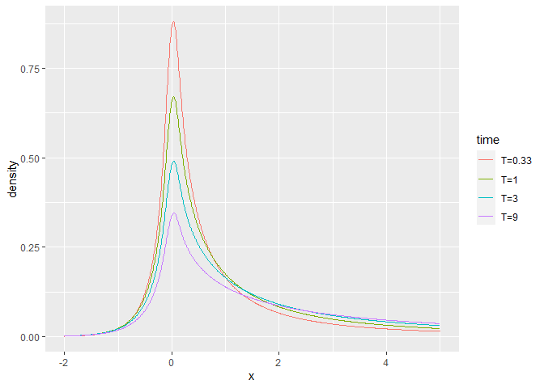

<!-- README.md is generated from README.Rmd. Please edit that file -->
MittagLeffleR
=============

The MittagLeffleR `R` package

-   calculates probability densities, probabilities and quantiles
-   simulates random variables from both types Mittag-Leffler distributions
-   fits a Mittag-Leffler distribution to data.

The first type Mittag-Leffler distribution is a heavy-tailed distribution, and occurs mainly as a waiting time distribution in problems with "fractional" time scales, e.g. times between earthquakes.

The second type Mittag-Leffler distribution is light-tailed, and "inverse" to the sum-stable distributions. It typically models the number of events in fractional systems and is used for time-changes of stochastic processes, e.g. anomalous diffusion processes.

Installation
------------

You can install MittagLeffleR from GitHub with:

``` r
# install.packages("devtools")
devtools::install_github("strakaps/MittagLeffler")
```

Examples
--------

### Fitting a Mittag-Leffler distribution

Generate a dataset first:

``` r
library(MittagLeffleR)
y = rml(n = 10000, tail = 0.9, scale = 2)
```

Fit the distribution:

``` r
logMomentEstimator(y, 0.95)
#>        nu     delta      nuLo      nuHi   deltaLo   deltaHi 
#> 0.8979336 2.0222474 0.8975863 0.8982810 2.0202685 2.0242263
```

Read off

-   the shape parameter 0 &lt; *ν* &lt; 1,
-   the scale parameter *δ* &gt; 0,
-   their 95% confidence intervals.

### Calculate the probability density of an anomalous diffusion process

Standard Brownian motion with drift 1 has, at time *t*, has a normal probability density *n*(*x*|*μ* = *t*, *σ*<sup>2</sup> = *t*). A fractional diffusion at time *t* has the time-changed probability density

*p*(*x*, *t*)=∫*n*(*x*|*μ* = *u*, *σ*<sup>2</sup> = *u*)*h*(*u*, *t*)*d**u*

where *h*(*u*, *t*) is a second type Mittag-Leffler probability density with scale *t*<sup>*α*</sup>. (We assume *t* = 1.)

``` r
tail <- 0.65
dx <- 0.01
x <- seq(-2,5,dx)
umax <- qml(p = 0.99, tail = tail, scale = 1, second.type = TRUE)
u <- seq(0.01,umax,dx)
h <- dml(x = u, tail = tail, scale = 1, second.type = TRUE)
N <- outer(x,u,function(x,u){dnorm(x = x, mean = u, sd = sqrt(u))})
p <- N %*% h * dx
plot(x,p, type='l', main = "Fractional diffusion with drift at t=1")
```



### Vignettes

To display the vignettes, do `help(package="MittagLeffleR")` and click on the vignettes link.

-   **MLdist.Rmd:** shows plots with the basic properties of the two distributions.
-   **probsNquantiles.Rmd:** details about how probability densities, quantiles and random variables are calculated using the Mittag-Leffler function and the package `stabledist`
-   **parametrisation.Rmd:** details about how the parameters for the stable distribution were chosen.
